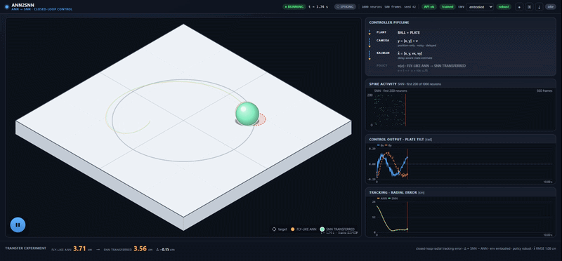
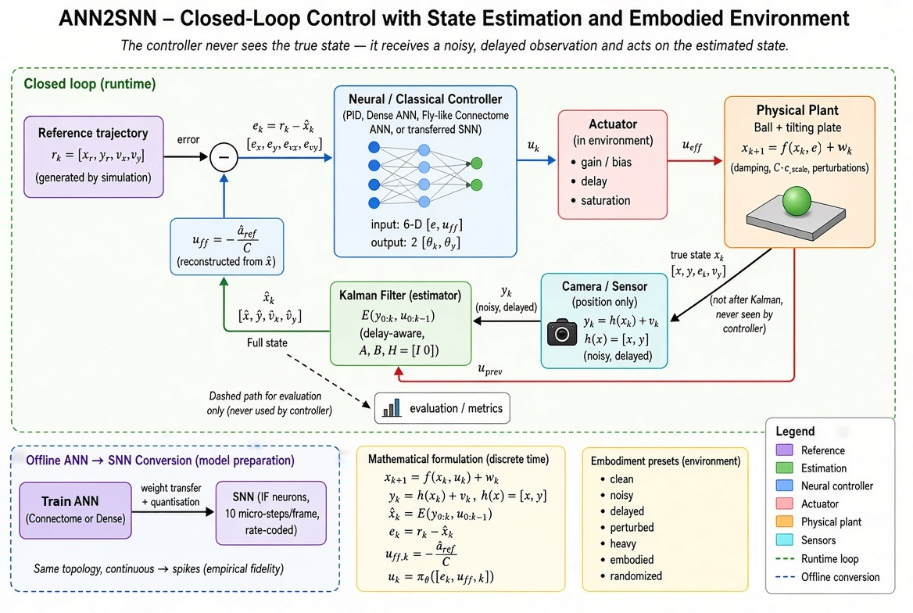

# ANN2SNN — ANN → SNN closed-loop control with state estimation

Keep a ball on a tilting plate by **estimating** the plant state from a
position-only camera and controlling it with a **PID teacher**, a **fly-like
recurrent connectome ANN**, or a **rate-coded spiking network transferred** from
that ANN.

The design point is the control/estimation separation: the controller **never
sees the true state**. It gets a noisy, delayed measurement `y = [x, y] + v` from
the camera, reconstructs `x̂ = [x, y, vx, vy]` with a delay-aware Kalman filter,
and acts through an embodied actuator (delay, gain, saturation). The ANN → SNN
step is an **offline model conversion**; both policies are then dropped into the
**identical** closed loop, so the comparison holds the plant and reference fixed.

<p align="center">
  
</p>
<p align="center"><em>The dashboard: the fly-like ANN and the transferred SNN rolling on one plate, the SNN spike raster, the control output, the tracking error, and the ANN → SNN transfer result bar. A single Play button drives the whole shared cursor.</em></p>

---

## The whole project in one picture

<p align="center">
  
</p>

* **Closed loop (runtime)** — reference → error → policy → actuator → plant →
  camera → Kalman estimator → back into the error. The plant's true state is used
  **only** by the metrics block, never by the controller.
* **Offline ANN → SNN conversion** — weight transfer from the trained ANN into an
  integrate-and-fire network (10 micro-steps per frame, rate-coded output). It is
  an *empirical* approximation, not an identity, and there is **no quantisation**.
* **Embodied environment** — sensing, actuation, body and perturbations are all
  configurable presets (see [`docs/EMBODIMENT.md`](docs/EMBODIMENT.md)).

> The diagram predates the final engine in two places: the error is drawn as
> `e = r − x̂` where the code uses `e = x̂ − r` (the equivalent sign for
> `ẍ = −Cθ`; see below), and "quantisation" is labelled in the transfer box
> although the transfer is rate-coded with none.

---

## Examples — swappable plant + task

The same engine drives more than one **example**; everything plant-specific
(step, reference, estimator model, metric, bounds, labels) is pluggable, while the
controller contract, distillation, ANN→SNN transfer, sessions and API stay shared.

| Example | Plant | Command | Task |
|---|---|---|---|
| **Balancing ball** (`ball`, default) | ball rolling on a tilting plate | plate tilt `[θx, θy]` rad | track a circular orbit |
| **Hovering drone** (`drone`) | 3-D point mass | thrust `[ax, ay, az]` m/s² | lissajous flight path or hover |
| **GPS-denied drone** (`drone_gps_denied`) | 3-D point mass | thrust `[ax, ay, az]` m/s² | same flight path, **no absolute position**: IMU + barometer + optical flow + geometry-gated checkpoint fixes |

```bash
python -m sim_engine benchmark --example drone --steps 500
python -m sim_engine train --example drone --profile robust --save weights_drone.pt
```

```python
engine = Engine(EngineConfig(example="drone", train_on_init=True))
report = engine.run_benchmark(["pid", "flylike_ann", "snn_transferred"])
```

HTTP: `POST /api/benchmark {"example": "drone", ...}`; the example catalogue is in
`GET /api/controllers` (`examples`, `example_names`, `default_example`) and weights
are cached per `(example, profile, seed)`. Adding a new example is one module plus
`register_example(...)` — see [`docs/EXAMPLES.md`](docs/EXAMPLES.md).

The dashboard's **EXAMPLE** selector switches the stage between the isometric
plate view and the 3-D corridor flight view and relabels every panel from the
catalogue (`PLATE TILT [rad]` vs `THRUST [m/s²]`, `ON PLATE` vs `IN CORRIDOR`).
An **EXTENDED ↗** link opens `/extended`: the same run with full telemetry — every
state estimate per controller, the estimator internals (per-channel samples,
innovations, covariance) and a per-frame readout — over an opt-in
`trace_level: "full"` benchmark. See
[`docs/DASHBOARD.md`](docs/DASHBOARD.md#extended-view-extended).

Each example owns its **sensor suite**, so the estimator can be fed what the
vehicle can actually measure. `drone_gps_denied` drops the position camera for an
accelerometer-driven Kalman prediction plus barometer, optical flow and occasional
checkpoint fixes; the pipeline panel lists the channels and the stage draws the
controller's belief next to the true body. See
[`docs/EXAMPLES.md`](docs/EXAMPLES.md#gps-denied-drone).

---

## The closed loop

```
x_{k+1} = f(x_k, u_k) + w_k                          plant (ball + plate)
y_k     = h(x_k) + v_k        h(x) = [x, y]          camera: position-only
x̂_k     = E(y_{0:k}, u_{0:k-1})                      E = delay-aware Kalman filter
e_k     = x̂_k − r_k                                  tracking error (sign: see note)
u_ff,k  = −â_ref,k / C         â_ref from x̂, known C  feed-forward command
u_k     = π_θ([e_k, u_ff,k])                          policy: 6-D input → [θx, θy]
u_eff   = actuator(u_k)        gain · delay · saturate
```

* **The controller acts on the estimate**, `π(x̂ − r)`, never on `r − x`.
* **Feed-forward is reconstructed, not privileged.** Because `e = x̂ − r`, the
  reference is recoverable as `r̂ = x̂ − e`; a three-point second difference gives
  `â_ref`, and `u_ff = −â_ref/C`. That is the same channel the analytic PID uses,
  so the learned arms are compared like-for-like.
* **Sign note**: the code uses `e = x̂ − r` (`error_vector`), not `r − x̂`. With
  `ẍ = −Cθ`, a ball right of the reference needs a positive tilt, so the command
  is a positive function of `x − r`. The teacher, the labels, and both networks all
  use this convention consistently.

## The brains

Every arm reads the same **6-D policy input** `[ex, ey, evx, evy, uff_x, uff_y]`
and outputs a saturated plate tilt `[θx, θy]`.

| Brain | Class | Kind |
|---|---|---|
| **PID controlled** | `ClassicalPDController` | analytic PD + acceleration feed-forward (the teacher) |
| **PID (no feed-forward)** | `ClassicalPDController(use_feedforward=False)` | diagnostic arm: the no-FF performance limit |
| **Random ANN** | `DenseNNController` (untrained) | `6 → N ReLU → 2`, honest baseline |
| **Dense ANN (distilled)** | `DenseNNController` (trained) | behavioural distillation of the PID teacher |
| **Fly-like ANN** | `ConnectomeANNController` | sparse **recurrent** connectome, Dale's law, balanced E/I |
| **SNN transferred** | `LosslessConnectomeSNN` | rate-coded IF transfer of the connectome ANN |

## Results

Reference run: **500 frames = 10 s** at 50 Hz, clean environment, 1000 neurons,
seed 42 (mean radial tracking error):

```
1. pid              mean  1.447 cm
2. dense_ann        mean  1.631 cm
3. flylike_ann      mean  1.797 cm
4. snn_transferred  mean  2.029 cm
5. pid_no_ff        mean  7.556 cm     # PD without the acceleration feed-forward
6. random_ann       mean 634.607 cm    # diverges over the longer horizon
```

* **The feed-forward channel is the whole story of the old gap.** `pid_no_ff` —
  the same PD law with `u_ff` removed — sits at ≈7.6 cm, the no-feed-forward
  limit the learned arms used to be stuck at. Giving the networks the
  KF-reconstructed `u_ff` moved them to ≈1.6–2.0 cm.
* **The SNN transfer is empirically faithful, not identical.** Over 5 seeds the
  ANN tracks `1.675 ± 0.063 cm` and the SNN `1.931 ± 0.082 cm` (≈0.26 cm gap);
  the recurrence runs on binary spikes where the ANN uses continuous activations.
* **Report spread, not a point estimate**: `python -m sim_engine benchmark --seeds
  42,1,2,3,4`.

## Embodiment presets

The same benchmark, with the body and environment turned into part of the problem:

| Preset | What changes |
|---|---|
| `clean` | ideal sensing; the Kalman filter still reconstructs velocity |
| `noisy` | position σ 5 mm |
| `delayed` | sensor 3 / actuator 2 frames (≈60/40 ms) |
| `perturbed` | a 0.15 m/s **velocity** kick every 60 frames |
| `heavy` | damping 0.6, `c_scale` 0.8 (lossy body) |
| `embodied` | σ 4 mm + sensor 2 / actuator 1 frames + 0.12 m/s kicks + damping 0.3 + `c_scale` 0.9 |
| `randomized` | seeded per-episode randomisation of `c_scale` / `damping` |

Training profiles: `clean` (nominal) and `robust` (distilled inside the embodied
environment, so the labels are the *deployed* law). Sweeps over
`preset · noise · delay · impulse` are in `sim_engine/robustness.py`.
Details: [`docs/EMBODIMENT.md`](docs/EMBODIMENT.md).

---

## Install

```bash
pip install -r requirements.txt      # torch, numpy, matplotlib
# or install the engine as a package:
pip install -e ".[dashboard,video,dev]"
```

CPU-only is fine — everything runs on CPU.

## Quick start

```python
from sim_engine import Engine, EngineConfig

engine = Engine()                                # untrained brains (instant)
report = engine.run_benchmark(["pid", "random_ann", "flylike_ann", "snn_transferred"])
print(report["ranking"])

# distill the learned brains first (closed-loop teacher through the Kalman filter)
engine = Engine(EngineConfig(train_on_init=True))
report = engine.run_benchmark(["pid", "flylike_ann", "snn_transferred", "dense_ann"])
```

## Command line

```bash
python -m sim_engine list                        # catalogue of brains
python -m sim_engine describe                    # full engine config as JSON
python -m sim_engine benchmark --controllers pid,flylike_ann,snn_transferred \
        --steps 500 --out results.json
python -m sim_engine benchmark --seeds 42,1,2,3,4        # mean ± spread
python -m sim_engine benchmark --embodiment embodied     # embodied environment
python -m sim_engine train --profile robust --embodiment embodied --save weights_robust.pt
python -m sim_engine robustness --axis delay --out robustness.json
python -m sim_engine session --controller snn_transferred --frames 20 --verbose
```

`--train` distils in-memory before evaluating; `--weights weights.pt` reuses a
saved bundle (format `ann2snn.sim_engine.weights@2`).

## Interactive dashboard

The browser dashboard in `server/` (Flask API) + `web/` (Vite + vanilla JS/Canvas)
presents one story — the **ANN → SNN transfer experiment**:

* **Hero stage** — isometric 3D plate with the fly-like ANN and SNN-transferred
  balls, the target orbit, faint **camera measurements**, and the controller's
  **estimated** position as a hollow ring.
* **Pipeline** — `PLANT → CAMERA → KALMAN → POLICY` rows, with the offline
  ANN → SNN weight transfer called out as not part of the loop.
* **Spike activity, control output, tracking** — the SNN raster, the SNN tilt
  commands, and the ANN/SNN radial error, all on the shared frame cursor.
* **Environment selector** (header) — clean · noisy · delayed · perturbed · heavy ·
  embodied · randomized, default **embodied**, with a `clean`/`robust` policy pill;
  a footer **robustness strip** shows ANN/SNN error across presets.
* **Result bar** — ANN error · SNN error · `Δ = SNN − ANN`.
* **Capture** — `●` records the hero canvas (WebM), `▣` records the whole tab,
  `⤓` renders a server-side MP4.

```bash
make install          # one-time
make up               # build the frontend + serve on :8080
make test             # engine + backend + renderer tests
make videos-train     # videos/01_random_ann.mp4 … all_controllers_sequence.mp4
```

Anyone without that environment can run the self-contained image — no compose or
BuildKit needed:

```bash
make up-docker        # plain docker build + run, auto-picking a free host port
make docker-run       # same; or: make compose-up PORT=9000
```

See [`docs/DASHBOARD.md`](docs/DASHBOARD.md) for the API, UI, recording workflow,
the DinD recipe and the standalone image.

## The reusable API (for the web backend)

`sim_engine.api.EngineService` is the transport-agnostic seam the Flask layer
wraps: plain dicts in, JSON-serializable dicts out — no torch objects cross the
boundary.

```python
from sim_engine.api import EngineService

svc = EngineService({"steps": 500, "embodiment_preset": "embodied", "train_on_init": True})

svc.controllers()                            # catalogue for the UI
svc.benchmark(["pid", "snn_transferred"])    # batch closed-loop report

info = svc.new_session("snn_transferred")    # interactive stepping
sid  = info["session_id"]
obs  = svc.step(sid)                         # advance one 20 ms frame
obs  = svc.step(sid, n=10)                   # or ten frames
svc.reset(sid)
svc.trajectory(sid)                          # whole recorded trace
```

See [`docs/API.md`](docs/API.md) for the full surface and response shapes.

## Package layout

```
sim_engine/
├── physics.py          # step_physics(), constants, BallPlatePlant, N_IN=6
├── reference.py        # orbit reference trajectory (pos/vel/acc)
├── config.py           # Plant/Network/Embodiment/Benchmark/Training/Engine configs
├── controllers/
│   ├── base.py         # BaseController, error_vector(), ReferenceAccelEstimator
│   ├── classical.py    # ClassicalPDController (+ `use_feedforward`)
│   ├── dense.py        # DenseNNController
│   ├── connectome.py   # ConnectomeTopology, ConnectomeANNController
│   └── snn.py          # LosslessConnectomeSNN (rate-coded IF transfer)
├── training.py         # closed-loop behavioural distillation + weight save/load
├── environment.py      # embodied env: sensing, actuation, body, perturbations
├── estimators.py       # Kalman filter (position-only camera → full state)
├── robustness.py       # difficulty sweeps + multi-seed aggregation
├── benchmark.py        # closed-loop evaluation + metrics/traces
├── registry.py         # name → controller factory (incl. `pid_no_ff`)
├── engine.py           # Engine + SimulationSession
├── api.py              # JSON-in/JSON-out API (EngineService)
├── serialization.py    # tensor/numpy → JSON helpers
└── cli.py / __main__.py

server/    # Flask API over EngineService (routes, runtime, validation)
web/       # Vite + Canvas dashboard (builds into server/static)
tools/     # matplotlib + ffmpeg MP4 renderer and CLI
docs/      # DASHBOARD.md · EMBODIMENT.md · API.md · control_loop.jpg · dashboard.gif
examples/  # run_benchmark.py
Makefile   # install / test / web-build / up / videos / docker
```

### Design rules

* **`physics.py` owns every constant.** Controllers import `DT`, `MAX_TILT`,
  `C_CONST`, `N_IN`, … from there — nothing is re-hardcoded.
* **One controller contract.** Every brain implements
  `reset()` + `act(estimate, ref) -> tilt`, so `benchmark.run_closed_loop` is
  controller-agnostic and a new brain is a drop-in.
* **Observation is separate from control.** The estimator is the only component
  that touches the measurement; policies only ever see `x̂`.
* **Topology is data, not code.** `ConnectomeTopology` is a seeded, immutable
  anatomy (edges + E/I polarity); only synaptic *magnitudes* are trainable, which
  is what makes Dale's law meaningful.
* **No web framework in the engine.** `api.py` is pure dict-in/dict-out.

## Physics

A ball rolling without slipping on a plate tilted by `(θx, θy)`:

```
x'' = -(5/7) g sin(θx) ≈ -C θx        C = (5/7) g = 7.007 m/s²/rad
y'' = -(5/7) g sin(θy) ≈ -C θy
```

Integrated explicitly at `DT = 0.02 s` (50 Hz, so the default 500-frame episode
is **10 s**), with the plate angle saturated to `MAX_TILT = 0.25 rad`. The
reference is a circle of radius `0.15 m` at `0.5 Hz`. Optional body terms:
velocity damping and a scaled rolling gain `C·c_scale`.

## Tests

```bash
python -m pytest tests server/tests tools/tests -q
```

Engine (physics, controllers, distillation, estimator, embodiment), backend
(Flask API, static bundle contract) and renderer suites; plus a CI workflow at
`.github/workflows/ci.yml`.

## License

MIT — see [`LICENSE`](LICENSE).
